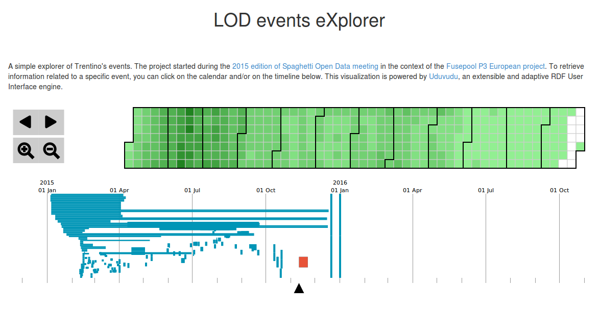
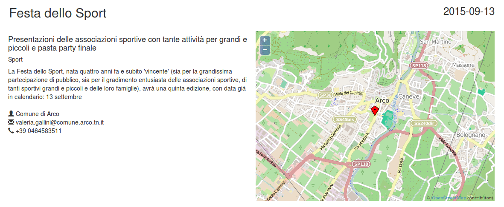
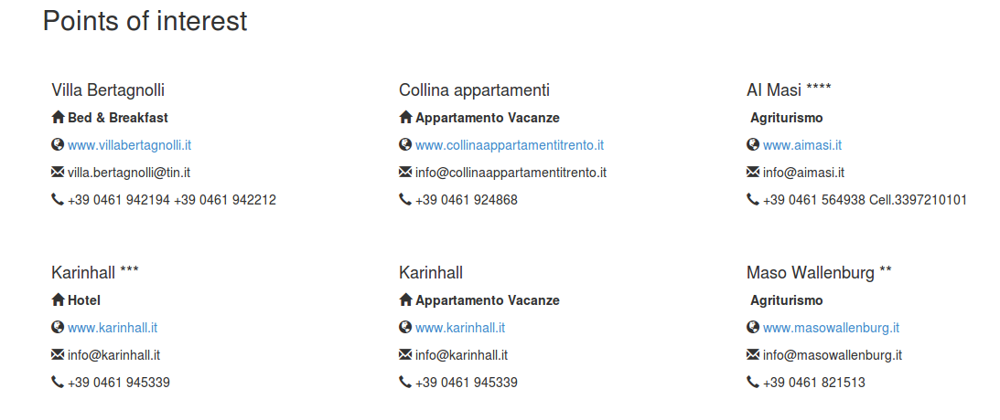

# LOD events eXplorer

This project has started during the LOD hackathon organized in Bologna (March 28, 2015) #SOD2015 in the context of the Fusepool P3 project. Authors: @alemela and @giuseppefutia.

To run the project you need to
* Install NodeJS (we have tested our tool with v0.12.0);
* Go to the ```server``` directory and run ```node server.js''';
* Open a browser at ```http://localhost:3000```.

## Description

In this project we have created an interactive visualization to represent Trentino's events data made available during the #SOD 2015 hackathon. We show all events using a calendar and a timeline to explore data starting from a specific period of time.





We have created a specific template to show all data related to a specific event. Location data (latitude and longitude) are shown using a map by OpenStreetMap.




We have also created a carousel to show the image retrieve from Wikipedia reading information in the skos:related properties.

[TO DO SCREENSHOT IMAGE]

In our visualization we are also able to show points of interest close to the choosen event (currently in the radius of 20 km).




## How we have faced "Future works"

After the SOD hackathon, we have defined some objectives that we want to develop to improve our work. Each point is followed by a brief explanation on how we face the task.

* *Improving scalability*: for testing reasons, we have created SPARQL queries for retrieving all data necessary to create the visualizations. We want to identify cases for launching SPARQL queries when users interact with the visualizations to get specific data.
	* **[RESOLVED] We have written many punctual SPARQL CONSTRUCT queries in order to get data related to a specific event and fit these data in the Uduvudu framework, combining them with other resources (POIs and Wikimedia images)**.
* *Binding the timeline and the graph visualization*: when you click on an element of the timeline, the graph related to this specific event of the timeline is automatically generated on the visualization.
	* **[RESOLVED] We automatically generate the visualization of details of a single event clicking on an element of the timeline, but we have concluded that the graph is not the right way to visualize information of a single event**.  
* *Improve the graph as tool for exploring data*: we have developed a rough graph to represent entities related to a specific event. From this point, we want to visualize data related to a specific entity of the graph clicking on a specific node. For example, starting from a node, we want to see which organizations are involved, which other events they organize, and in which area of the Trentino regione. In this way we can also visualize some statistics related to this data, also to understand the potential quality of the event.
	* **[WONTFIX] We have concluded that the graph is not a useful way for the user to understand the information on a single event. We have preferred to choose a clearer visualization of data as shown above.**
* *Using other datasets and APSIs*: for each event, we want to also visualize points of interest close to them. We also want to exploit entities extracted with the NER tool (represented with the skos:related properties), retrieving images using Wikipedia and WikiData APIS. In this way, the user can obtain a better understanding of the event's context.
	* **[RESOLVED] In our visualization we show points of interest close to a single event (radius of 20 km) and retrieve images from Wikipedia to represent skos:related data.**
* *Extending the Uduvudu templates*: during the hackathon we have discovered the potential of the Uduvudu project (https://github.com/uduvudu/uduvudu). We want to extend its templates with the visualizations developed on our project to improve the range of possible visualizations of RDF data.
	* **[RESOLVED] Many parts of this visualization are built extending the Uduvudu framework.**
