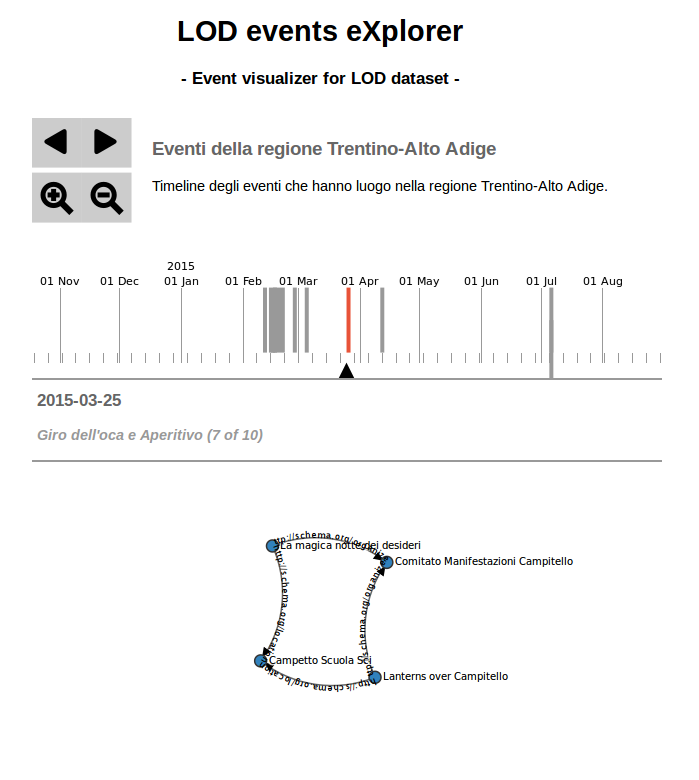

# LOD events eXplorer

This project has been developed during the LOD hackathon organized in Bologna (March 28, 2015) #SOD2015. Authors: @alemela and @giuseppefutia.

## Description

In this project we wanted to create an interactive visualization to represent Trentino's events data made available during the hackathon. On the one hand we have developed a timeline on which binding these data for exploring initiatives in a specific period of time. On the other hand, we have started to create a graph in order to use the RDF representation for exploring data.

About technology aspects, we have used jQuery for making query to the endpoint SPARQL of the Fusepool platform and D3.js for data visualization.

In the following sections, we explaing which data we have used and the future works on this project.

## Linked Data from Fusepool P3 platform

In order to create our D3.js visualization, we have used the SPARQL endpoint exposed by the Fusepool platform. In particular we have defined 2 different queries. 

With the first query, we have retrieved all events from the Trentino datasets, including the start date and the end date. Therefore, we have binded these data on a timeline.

	PREFIX rdfs: <http://www.w3.org/2000/01/rdf-schema#>
	PREFIX schema: <http://schema.org/>
	PREFIX xsd: <http://www.w3.org/2001/XMLSchema#>
	PREFIX dbo: <http://it.dbpedia.org/ontology>
	PREFIX skos: <http://www.w3.org/2004/02/skos/core#>

	SELECT ?subject ?headline ?title ?dateStart ?dateEnd
	FROM <http://sandbox.fusepool.info:8181/ldp/wr-ldpc/Trentino-Events-1/eventi-xml-xml-transformed>
	WHERE {
	  ?subject a schema:Event ;
	             schema:description ?title ;
	             rdfs:label ?headline;
	             schema:startDate ?dateStart ;
	             schema:endDate ?dateEnd .
	  FILTER( lang(?title)="it" )
	}

With the second query, we have retrieved all the entities related to all the events for creating the graph visualization.

	PREFIX rdfs: <http://www.w3.org/2000/01/rdf-schema#> 
	PREFIX schema: <http://schema.org/>
	PREFIX xsd: <http://www.w3.org/2001/XMLSchema#>
	PREFIX dbo: <http://it.dbpedia.org/ontology>
	PREFIX skos: <http://www.w3.org/2004/02/skos/core#>

	SELECT distinct ?subject ?subjectLabel ?property ?objectLabel
	FROM <http://sandbox.fusepool.info:8181/ldp/wr-ldpc/Trentino-Events-1/eventi-xml-xml-transformed>
	WHERE {
  		?subject ?property ?object .
  		?subject a schema:Event ;
             schema:description ?title ;
             rdfs:label ?subjectLabel .
  		?object rdfs:label ?objectLabel .
  	FILTER( lang(?title)="it" )
	}

## Future works

* *Improve scalability*: for testing reasons, we have created SPARQL queries for retrieving all data necessary to create the visualizations. We want to identify cases for launching SPARQL queries when users interact with the visualizations to get specific data.
* *Binding the timeline and the graph visualization*: when you click on an element of the timeline, the graph related to this specific event of the timeline is automatically generated on the visualization.
* *Improve the graph as tool for exploring data*: we have developed a rough graph to represent entities related to a specific event. From this point, we want to visualize data related to a specific entity of the graph clicking on a specific node. For example, starting from a node, we want to see which organizations are involved, which other events they organize, and in which area of the Trentino regione. In this way we can also visualize some statistics related to this data, also to understand the potential quality of the event.
* *Extend the Uduvudu templates*: during the hackathon we have discovered the potential of the Uduvudu project (https://github.com/uduvudu/uduvudu). We want to extend its templates with the visualizations developed on our project to improve the range of possible visualizations of RDF data.

